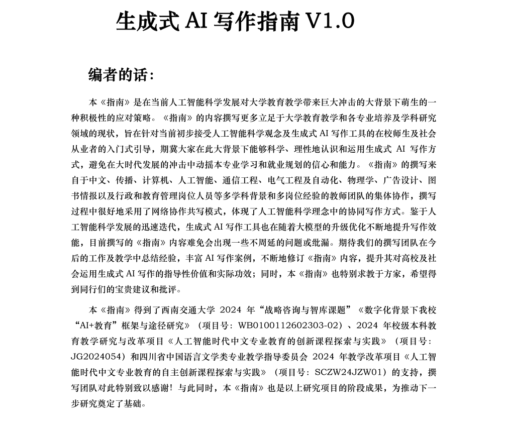
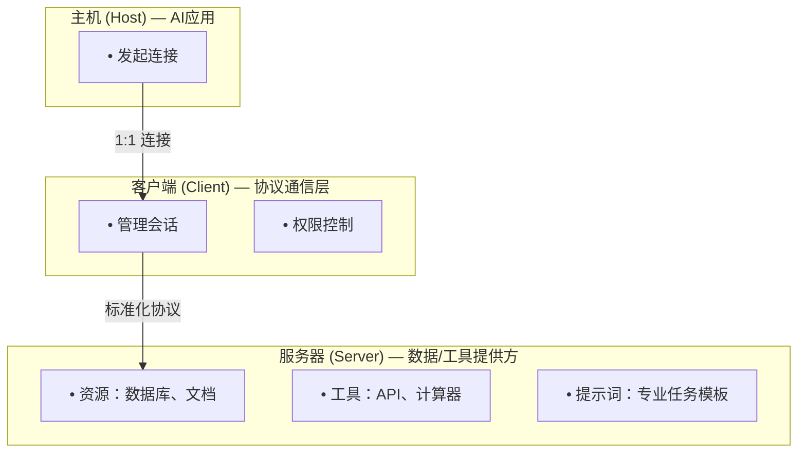
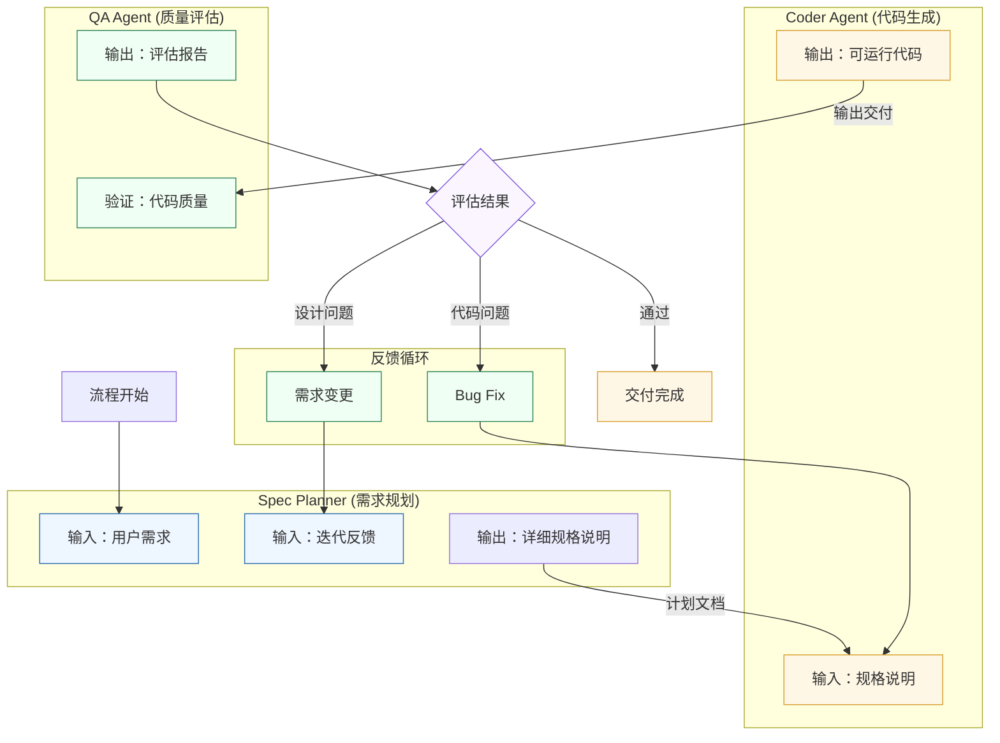
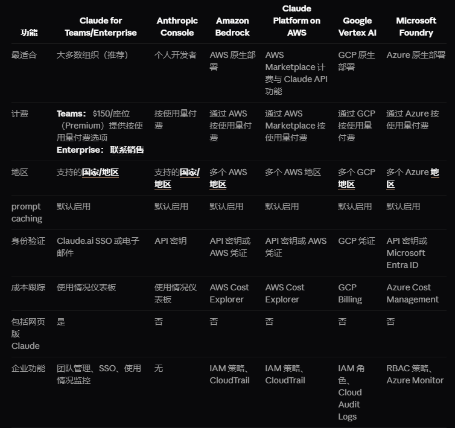
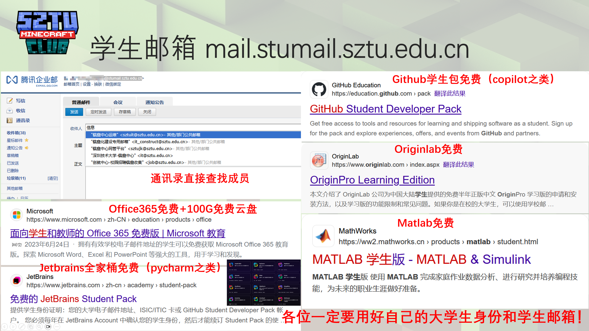

# **AI工具使用文档 V1.2**

2026.04.14

深圳技术大学图书馆 编写

---

## **0 前言，以及目录**

### 前言

- 本文希望介绍一些常见的、有关于生成式人工智能（AIGC）的概念，并粗略地介绍其在一些领域的应用。与此同时，本文提供了一些关于学生优惠领取的教程，帮助广大本科生充分利用自己的身份优势获取一些应得利益
- 本文使用包括 Qwen 3.5、GPT-5 mini 在内的大语言模型进行辅助写作（包括信息搜集、代码示例等）与排版。所有内容都经过了人工校对，并努力遵循一些通用的 AI 辅助写作原则
- 本文介绍的一些概念到目前（2026.04.07）依然不存在准确的官方译名，请以其英文为基准
- 本文偏向介绍大语言模型在编程等领域的应用，并在前四章介绍一些通用概念
- 本文的代码仅供示意参考，若读者想上手进一步的编码工作，请点击文档提供的官方 Wiki 跳转链接获取更多信息
- 本文写作时间紧促，可能存在事实疏忽、时效滞后或排版不当的问题，欢迎反馈
- 项目已经开源在 <https://github.com/T34851969/AI------>，欢迎提交 issue

### 目录

- [**AI工具使用文档 V1.2**](#ai工具使用文档-v12)
  - [**0 前言，以及目录**](#0-前言以及目录)
    - [前言](#前言)
    - [目录](#目录)
  - [**1 关键概念**](#1-关键概念)
    - [理解以下概念（至少前面几个）至关重要，无论你打算或已使用 AI](#理解以下概念至少前面几个至关重要无论你打算或已使用-ai)
  - [**2 可供参考的 AI 写作指南推荐**](#2-可供参考的-ai-写作指南推荐)
    - [2.1 OpenAI —— 《学生使用ChatGPT写作指南》](#21-openai--学生使用chatgpt写作指南)
    - [2.2 西南交通大学 —— 《生成式AI写作指南V1.0》](#22-西南交通大学--生成式ai写作指南v10)
  - [**3 生成式 AI 方法论略谈**](#3-生成式-ai-方法论略谈)
    - [3.1 开发有效的基于文本的提示 —— CLEAR 框架概览](#31-开发有效的基于文本的提示--clear-框架概览)
    - [3.2 当代流变](#32-当代流变)
      - [3.2.1 Adaptive ：从“人适应AI”到“AI适应人”](#321-adaptive-从人适应ai到ai适应人)
      - [3.2.2 Reflective：从“人工评估”到“自主对齐”](#322-reflective从人工评估到自主对齐)
  - [**4 提示工程**](#4-提示工程)
    - [4.1 提示词与提示工程](#41-提示词与提示工程)
    - [4.2 CO-STAR 框架](#42-co-star-框架)
    - [4.3 提示词使用技巧](#43-提示词使用技巧)
  - [**5 Vibe Coding 基本概念与技术框架**](#5-vibe-coding-基本概念与技术框架)
    - [5.1 Vibe Coding](#51-vibe-coding)
      - [5.1.1 为什么出现 Vibe Coding？](#511-为什么出现-vibe-coding)
      - [5.1.2 Vibe Coding 参考](#512-vibe-coding-参考)
      - [5.1.3 一点提醒](#513-一点提醒)
    - [5.2 Agent（智能体）](#52-agent智能体)
      - [5.2.1 如何理解Agent？](#521-如何理解agent)
      - [5.2.2 Agent 示例](#522-agent-示例)
    - [5.3 MCP（模型上下文协议）](#53-mcp模型上下文协议)
      - [5.3.1 什么是MCP？](#531-什么是mcp)
      - [5.3.2 为什么需要 MCP？](#532-为什么需要-mcp)
      - [5.3.3 一个本地部署 MCP 服务器的示例](#533-一个本地部署-mcp-服务器的示例)
      - [5.3.4 补充](#534-补充)
    - [5.4 Agent Skill（智能体技能）](#54-agent-skill智能体技能)
      - [5.4.1 什么是Agent Skills？](#541-什么是agent-skills)
      - [5.4.2 Skill 项目的一个最小结构](#542-skill-项目的一个最小结构)
      - [5.4.3 SKILL.md 字段示例](#543-skillmd-字段示例)
      - [5.4.4 设计原则](#544-设计原则)
    - [5.5 Harness （约束框架）](#55-harness-约束框架)
      - [5.5.1 什么是Harness？](#551-什么是harness)
      - [5.5.2 为什么需要Harness？](#552-为什么需要harness)
      - [5.5.3 架构示意](#553-架构示意)
      - [5.5.4 设计原则](#554-设计原则)
      - [5.5.5 使用时机](#555-使用时机)
      - [5.5.6 Claude Code 意外泄露源码](#556-claude-code-意外泄露源码)
    - [5.6 检索增强生成（RAG）](#56-检索增强生成rag)
      - [5.6.1 什么是RAG？](#561-什么是rag)
      - [5.6.2 如何工作](#562-如何工作)
      - [5.6.3 一个代码示例](#563-一个代码示例)
    - [5.7 应用](#57-应用)
      - [5.7.1 什么在何处负责](#571-什么在何处负责)
      - [5.7.2 典型数据与调用流](#572-典型数据与调用流)
      - [5.7.3 常见协同模式与场景](#573-常见协同模式与场景)
      - [5.7.4 设计原则与最佳实践](#574-设计原则与最佳实践)
      - [5.7.5 简要示例](#575-简要示例)
      - [5.7.6 Q\&A](#576-qa)
      - [5.7.7 建议](#577-建议)
  - [**6. 一些高级 AI 应用简介**](#6-一些高级-ai-应用简介)
    - [6.1 OpenClaw](#61-openclaw)
      - [6.1.1 简介](#611-简介)
      - [6.1.2 部署事项](#612-部署事项)
      - [6.1.3 安全问题](#613-安全问题)
    - [6.2 Claude Code](#62-claude-code)
      - [6.2.1 Windows 下安装部署](#621-windows-下安装部署)
      - [6.2.2 其它安装](#622-其它安装)
      - [6.2.3 基本使用](#623-基本使用)
      - [6.2.4 优势](#624-优势)
  - [**7 针对本科学生的优惠项目**](#7-针对本科学生的优惠项目)
    - [7.1 GitHub Copilot 学生优惠概览](#71-github-copilot-学生优惠概览)
    - [7.2 申请前准备](#72-申请前准备)
      - [7.2.1 必备材料](#721-必备材料)
      - [7.2.2 常见问题](#722-常见问题)
    - [7.3 申请步骤](#73-申请步骤)
      - [7.3.1 进入申请页面](#731-进入申请页面)
      - [7.3.2 启动申请流程](#732-启动申请流程)
      - [7.3.3 身份验证（关键！）](#733-身份验证关键)
      - [7.3.4 提交与等待审核](#734-提交与等待审核)
      - [7.3.5 激活福利（关键！）](#735-激活福利关键)
    - [7.4 VS Code 中配置 GitHub Copilot](#74-vs-code-中配置-github-copilot)
      - [7.4.1 安装与授权](#741-安装与授权)
      - [7.4.2 核心功能速览](#742-核心功能速览)
      - [7.4.3 示例](#743-示例)
    - [7.5 福利续期与常见问题](#75-福利续期与常见问题)
      - [7.5.1 如何续期？](#751-如何续期)
      - [7.5.2 常见问题解答](#752-常见问题解答)
      - [7.5.3 其他免费/低价学生工具](#753-其他免费低价学生工具)
    - [7.6 提醒](#76-提醒)
  - [**8 学习资源**](#8-学习资源)
    - [8.1 基础入门](#81-基础入门)
    - [8.2 提示词工程](#82-提示词工程)
    - [8.3 高级开发（Tools / MCP / Agent / Skills / Harness）](#83-高级开发tools--mcp--agent--skills--harness)
    - [8.4 学习建议](#84-学习建议)
  - [**9 补充**](#9-补充)

---
<div style="page-break-before: always;"></div>

## **1 关键概念**

### 理解以下概念（至少前面几个）至关重要，无论你打算或已使用 AI

| 概念               | 英文                              | 定义                                                                      | 要义                                                                          |
| ------------------ | --------------------------------- | ------------------------------------------------------------------------- | ----------------------------------------------------------------------------- |
| **大语言模型**     | Large Language Model(LLM)         | 通过在海量文本数据上训练，能够理解、生成和推理人类语言的深度学习模型      | ChatGPT、Claude、Gemini 等对话 AI 的技术基础                                     |
| **词元**           | Token                             | 大语言模型处理文本的基本单位，可以是单词、子词或标点                      | 模型输入/输出长度以 Token 计费或限制，比如“ChatGPT”≈2个 Token                 |
| **上下文**         | Context                           | ①对话上下文：历史记录保持连贯性；<br> ②提示上下文：引导模型生成预期回答   | Prompt 工程的核心，影响输出质量的关键变量                                     |
| **提示词**         | Prompt                            | 用户输入给AI模型的指令或问题，是交互的主要方式                            | 设计精良的提示词能极大提升输出质量和相关性                                    |
| **工具调用**       | Function Calling / Tool Use(Tool) | 模型识别用户需求后，调用外部工具（搜索、计算器、API等）获取信息或执行操作 | 模型决策规划 + 应用安全执行；遵循 ReAct 循环；工具定义清晰规范                |
| **模型上下文协议** | Model Context Protocol(MCP)       | 标准化大模型与外部数据源、工具和服务连接的开放协议                        | “AI 的 USB 接口”：统一资源/工具/提示词接入、安全隔离凭证管理                  |
| **检索增强生成**   | Retrieval-Augmented Generation(RAG) | 先从外部知识库或文档中检索相关内容，再让模型基于检索结果生成回答          | 通过“先检索、后生成”减少幻觉，提升回答的准确性、时效性与可追溯性             |
| **智能体**         | AI Agent(Agent)                   | 能理解复杂目标、制定计划、调用工具并自主执行任务的AI系统                  | LLM + 规划 + 记忆 + 工具；自主性、反应性、主动性、社会性                      |
| **智能体技能**     | Agent Skill(Skill)                | 为智能体专门设计的、用于完成特定任务的专业化能力模块                      | 结构化文档+脚本+资源；单一职责 + 清晰触发 + 可运行示例                        |
| **约束框架**       | Harness                           | 在智能体系统中，负责评估、调度、编排和管理智能体技能使用的高级框架        | 与 Agent Skill 协同，负责规划技能调用序列、评估技能效果、优化任务执行流程  |

---
<div style="page-break-before: always;"></div>

## **2 可供参考的 AI 写作指南推荐**

### 2.1 OpenAI —— 《学生使用ChatGPT写作指南》

2024年11月14日，OpenAI 发布了《学生使用 ChatGPT 写作指南》（A Student's Guide to Writing with ChatGPT）。该指南涵盖了12项实用技巧和方法，旨在指导学生正确运用 ChatGPT，培养其严谨的思维方式及学术诚信意识。

1. **引用格式优化**：利用 ChatGPT 自动生成和调整引用格式，从而节省时间，使学生能更专注于内容的深度构建。
2. **快速了解新领域**：ChatGPT 助力学生迅速掌握新领域的基础知识，为深入探究奠定基础。
3. **资源推荐**：ChatGPT 可推荐相关学者、资源和关键词，引导学生研究方向，但需查阅原始文献以保障学术严谨性。
4. **深化复杂概念理解**：通过互动问答，帮助学生清晰掌握难点，促进对复杂理论的深度理解。
5. **增强文章结构**：针对论文结构提供改进建议，使内容逻辑更清晰，层次更分明。
6. **倒写大纲检查**：采用倒写大纲的方式检查文章结构和逻辑，确保各部分内容紧密衔接。
7. **引导深入思考**：通过互动对话启发学生思考，培养批判性思维，挖掘更深层次的见解。
8. **论点优化**：模拟反驳和论证强化，帮助学生识别论点中的薄弱环节，提升论述的说服力。
9. **多角度审视**：从不同历史或学术视角重新分析论点，拓展学生对主题的多维度理解。
10. **写作持续改进**：ChatGPT 提供即时反馈，助力学生不断优化写作质量。
11. **语音模式辅助阅读**：在阅读过程中，利用高级语音模式即时解答问题，提升学生对复杂内容的理解和吸收。
12. **技能提升和应用**：帮助学生锻炼分析和写作技能，通过反复练习提升逻辑性和表达能力。

**重要提醒**：使用 ChatGPT 辅助写作，必须遵守学术规范，确保 AI 使用的合规性，规范引用并明确说明自身如何使用 ChatGPT。善用AI工具，使其成为学习中的得力助手，而非替代独立思考的捷径。

**链接**：<https://openai.com/chatgpt/use-cases/student-writing-guide/>

### 2.2 西南交通大学 —— 《生成式AI写作指南V1.0》

《生成式AI写作指南V1.0》由西南交通大学多学科专家团队撰写，于 2024 年 10 月发布。该指南分三部分，旨在为高校及社会运用生成式 AI 写作提供参考和指导。以下是其内容的基本介绍：

1. **基础理论**：阐述生成式 AI 写作的特征、方法及常用工具，提出这是一种“人机协同的创作新模式”。
2. **应用场景**：详细介绍了在私人、公共、专业及教学性设计等不同场景中的 AI 写作应用与实践，并附案例。
3. **风险和规范**：分析了生成式 AI 写作的潜在风险（如内容准确性、数据偏见、削弱批判性思考等），并明确了 AI 工具的定位，提出了避免学术不端、正确标注AI成果等规范建议。

**链接**：<https://www.cssn.cn/skgz/bwyc/202410/t20241012_5790396.shtml>



---
<div style="page-break-before: always;"></div>

## **3 生成式 AI 方法论略谈**

生成式人工智能工具通过海量数据进行训练，并基于这些数据创建模型。当你给一个人工智能工具提供提示时，它会使用数据模型生成响应。

大部分生成式人工智能工具通过向模型发送文本形式的消息工作，这在所有网页端、应用内集成的 AI 工具通用。不少模型也支持向其传输文件，比如文本文件、携带文字的图片，通过一些内置工具转化为文字并像普通的文本模型那样运作。还有一些模型支持文字生成图片、视频、音频等，这些模型被称作多模态模型。

### 3.1 开发有效的基于文本的提示 —— CLEAR 框架概览

**基本信息介绍：**

- **全名**：The CLEAR Framework (CLEAR Path)
- **作者**：Leo S. Lo（时任美国新墨西哥大学图书馆院长）
- **出处**：*The Journal of Academic Librarianship* (学术图书馆员期刊)
- **发表时间**：2023年 (第49卷第4期)
- **DOI**：`10.1016/j.acalib.2023.102720`
- **原文标题**：*The CLEAR path: A framework for enhancing information literacy through prompt engineering*
- **链接**：<https://www.sciencedirect.com/science/article/pii/S0099133323000599>

具体内容

| 类别                | 描述                                                                               | 示例                                                                                                                                   |
| :------------------ | :--------------------------------------------------------------------------------- | :------------------------------------------------------------------------------------------------------------------------------------- |
| **Concise 清晰**    | 要求具体；使用简单语言；优先考虑关键信息                                           | "列出工业革命期间最重要的三个社会因素。""将文本翻译成法语。"                                                                           |
| **Logical 逻辑**    | 以逻辑顺序组织信息；建立上下文和关系；避免在单个提示中包含过多指示                 | "解释量子力学……"<br>"这门物理学分支是否有任何基本原则或定律？"                                                                         |
| **Explicit 明确**   | 定义明确的指示；设定阅读水平和输出格式；为 ChatGPT 指派角色                        | "以简单易懂的语言解释以下段落：'Lorem ipsum...'"<br> "假设你是一名本科科学学生，用简单的术语描述 Krebs 循环。"                         |
| **Adaptive 适应**   | 保持灵活（重新措辞、重构）；尝试不同的方法；创意性地使用提示                       | "实际上，这不是我想表达的意思。我指的是________。""能否提供更多示例？"                                                                 |
| **Reflective 反思** | 仔细评估 AI 的响应；识别可改进的领域（这需要时间）；<br>利用洞察进一步优化参与策略 | 信任但要验证，不要假设工具返回的信息都是准确的。可以考虑以下问题：我能否通过其他来源验证信息？生成的内容是否符合我对该主题已有的理解？ |

### 3.2 当代流变

尽管这个框架发布距今已经三年，但是它依然活跃在各 AI 应用领域。并且在 Adaptive 以及 Reflective 这两个方面，发展出各具特色的应用方向。这些方向体现了人机交互中，“人走向AI” 到 “AI走向人” 的变化。

#### 3.2.1 Adaptive ：从“人适应AI”到“AI适应人”

| 方向         | 内涵                                                           | 应用                                                                                                                                                                                                                                                    |
| :----------- | :------------------------------------------------------------- | :------------------------------------------------------------------------------------------------------------------------------------------------------------------------------------------------------------------------------------------------------ |
| **交互模式** | 从单轮指令发展为多模态、多轮次、工作流化的复杂交互             | • **多模态自适应**：用户可混合使用文本、图像、文档、语音等多种输入方式，AI能理解并适应这种混合上下文<br>• **工作流编排**：用户可通过一个主提示，让AI自动分解任务、调用工具（如计算器、浏览器、代码解释器）、执行多步骤操作并返回最终结果                |
| **技术升级** | 适应性的责任部分从用户端转移至系统端，通过更强大的底层技术实现 | • **Agent 技术**：AI能根据目标自主规划、执行并调整行动序列。例如，给定目标“分析公司Q1财报并总结风险”，AI可自动搜索最新财报、提取数据、进行计算分析、生成报告<br>• **工具调用**：AI能根据对话上下文，自适应地决定何时以及如何调用外部工具或API来完成任务 |
| **个性化**   | AI能够学习并适应用户的长期偏好、写作风格和专业领域知识         | • **自定义指令与长期记忆**：用户可设置全局偏好，AI在后续所有对话中持续适应<br>• **领域微调与检索增强生成（RAG）**：企业可将AI模型在内部数据上微调，或通过检索增强生成技术，使 AI 的回答自适应于特定的专业知识库                                                           |

#### 3.2.2 Reflective：从“人工评估”到“自主对齐”

| 方向               | 内涵                                                                                   | 应用                                                                                                                                                                                                                                           |
| :----------------- | :------------------------------------------------------------------------------------- | :--------------------------------------------------------------------------------------------------------------------------------------------------------------------------------------------------------------------------------------------- |
| **评估体系化**     | 对AI输出的反思不再仅依赖用户个人判断，而是发展出一套系统化的评估框架、基准和自动化工具 | • **红队测试与评估基准**：研究人员和开发者使用标准化测试集（如MMLU、GPQA）和对抗性测试（红队攻击）精确评估模型的准确性、安全性、偏见等参数<br>• **AI辅助评估**：用另一个 AI 模型（评判器）评估生成质量、指令对齐度，实现大规模、自动化初步反思 |
| **对齐与安全内化** | 反思的目标，从追求准确提高到 AI 对齐：，即安全、合规、符合**公序良俗**                 | • **安全层与内容过滤**：在模型响应生成前后，自动进行安全检查，过滤有害、偏见或不合规内容<br>• **宪法AI与RLHF**：通过人类反馈强化学习等技术，将公序良俗内化到模型中，模型即可即时反思与对齐                                                     |
| **可解释性与溯源** | 不仅关注答案**是什么**，更关注**为什么**，要求 AI 提供推理过程和证据                   | • **思维链**：鼓励AI展示其推理步骤，使用户能跟踪并反思其逻辑<br>• **溯源与引用**：对于基于检索的回答，要求AI明确标注信息出处，方便用户回溯验证，这是“信任但验证”原则的技术实现                                                                 |

---
<div style="page-break-before: always;"></div>

## **4 提示工程**

### 4.1 提示词与提示工程

**提示词**在 AI 领域中扮演着至关重要的角色，它指的是在 AI 模型执行任务时，为引导模型生成特定输出而提供的一段文字或数据，是用户与 AI 模型进行交互的一种方式。通过精心设计合理的提示词，用户可以更精准地控制AI模型的输出结果。简而言之，提示词就是用户与 AI 对话的文本，本质上是对 AI 提出的问题或指令。

**提示工程**（Prompt Engineering）则是指通过优化和设计提示词，以最大化 AI 输出的效果，从而更高效地利用大型语言模型（LLM）处理各类应用场景和研究领域的问题。这不仅仅是简单的提问，而是需要考虑如何分解问题、设置合适的上下文以及提供必要的细节背景等。其核心目标是找到最优的提示词，使AI能够最大限度地理解任务，并输出符合预期的高质量内容。换言之，学会设计出"最聪明的提问"，以便AI能够聪明地回应。

随着通用大模型的日益成熟，有些时候不再需要严格遵循模板来构思提示词，AI 工具已能够深入理解用户需求，并进行自主解析与细化。然而，深入理解提示词的核心逻辑依然至关重要。“提示词工程师”如此迅速的兴起与消亡提醒我们，“提示工程”已经从一种职业能力转变为专业素养 —— 就像外语之于专业/职业一样，并最终会向“通用素养”这个方向发展。

### 4.2 CO-STAR 框架

"CO-STAR 框架" 是一套结构化提示词设计方法，核心作用是帮助用户向 AI 清晰传递需求，减少 AI 误解，生成更精准、高效的响应。

其中一套解释，见链接：<https://goaireels.com/blog/prompt-engineering-101-the-co-star-framework/>

| 模块  | 英文全称                    | AI 需要知道什么                                                                                          | 示例                                                                                                                                                                                                                           | 常见误区                                                                       |
| :---- | :-------------------------- | :------------------------------------------------------------------------------------------------------- | :----------------------------------------------------------------------------------------------------------------------------------------------------------------------------------------------------------------------------- | :----------------------------------------------------------------------------- |
| **C** | Context（上下文）           | 提供任务相关的背景信息，包括时间、场景、关键前提及约束条件，帮助 AI 准确理解需求所处的业务环境与逻辑起点 | "本人任职于某初创企业运营部门，推广产品为'便携折叠电煮锅'，核心定位为学生宿舍及租房场景，零售单价 199 元。市场竞品普遍强调'大容量'属性，本产品核心差异点为'折叠后体积仅 A4 纸大小'与'智能防干烧安全保护'"                      | 遗漏关键业务背景（如未说明目标群体为学生，导致 AI 生成面向商务人士的文案风格） |
| **O** | Objective（目标）           | 明确本次交互期望达成的具体业务目标或可衡量的效果，指导 AI 聚焦输出方向                                   | "文案核心目标：面向 18-25 岁学生及租房人群，突出'便携收纳'与'使用安全'两大卖点，提升产品在小红书平台的内容种草效率与转化潜力"                                                                                                  | 目标表述模糊（如仅要求"撰写文案"，未明确"提升种草转化率"等可衡量指标）         |
| **S** | Scope（范围）               | 界定任务执行的内容边界，明确包含项与排除项，避免 AI 生成无关或冗余信息                                   | "输出范围：1 篇主文案（字数控制在 300 字以内）+ 3 个小红书平台话题标签；排除项：产品技术参数（如额定功率）、促销活动详情、售后服务政策"                                                                                        | 范围界定不清（如未限定字数，导致输出内容超出平台发布规范或使用场景）           |
| **T** | Task（任务）                | 将目标拆解为可执行、可验证的具体操作步骤，明确 AI 需完成的动作序列                                       | "执行步骤：1. 提炼 3 项核心卖点（便携性、安全性、性价比），每项附简要支撑理由；2. 采用场景化表达方式撰写主文案（例：'宿舍煮面无需等待，折叠收纳不占空间'）；3. 匹配 3 个高搜索量话题标签（如#学生党家电 #租房好物 #厨房神器）" | 任务指令笼统（如仅要求"突出卖点"，未指定"场景化表达"等具体执行标准）           |
| **A** | Audience（受众）            | 定义内容接收对象的群体特征，包括年龄、身份、认知水平及语言偏好，指导内容调性与表达策略                   | "目标受众为 18-25 岁在校学生及年轻租房群体，语言风格需贴近年轻化表达，适度使用网络流行语（如"刚需""提升幸福感"），避免使用生硬的专业术语或企业级表述"                                                                          | 忽视受众特征（如面向学生群体却采用企业采购场景的正式书面语，降低内容共鸣度）   |
| **R** | Response Format（响应格式） | 规定输出内容的结构化形式与呈现规范，便于后续直接使用或二次加工                                           | "输出规范：1. 核心卖点以"卖点关键词 + 支撑理由"的短句形式列出，共 3 项；2. 主文案独立成段，段落间逻辑连贯；3. 话题标签统一置于文末，格式为"#标签内容"，每项独占一行"                                                           | 未指定输出格式（如需结构化清单却获得大段连续文本，增加后期整理成本）           |

### 4.3 提示词使用技巧

在向AI提问前，可以通过下述技巧获得更符合要求的回答：

- **提供富含细节的背景信息**  
    例：请帮我写一个在 24 世纪的银河系发生的科幻故事，主要角色是进取号的传奇舰长 Picard，他们正在调查罗慕伦中立区的时候意外找到三个来自古地球的冬眠者，而罗慕伦人意外地与他们接触...

- **明确任务和要求，避免模糊不清的提问**  
    例：帮我写一篇 300 字的智能手表产品简介，重点突出功能和使用场景，面向技术小白。

- **学会角色扮演**  
    例：假设你是一名初中老师，向一群从未接触过AI提示词的初中生们用通俗的语言、生动的实例解释AI提示词的基本概念。

- **分解复杂问题**
  - 问题拆分：将一个大问题分解成几个小问题或子任务，逐一解决
  - 明确步骤：对于每个子问题，明确需要解决的步骤或需要考虑的因素
  - 优先级排序：确定哪些方面最重要，哪些可以稍后处理

- **要求逐步解释，索要出处和引用**
  - 步骤示例：提炼主题 → 检查遗漏 → 基于每个主题列要点 → 生成总结
  - 例：我正在计划一次长途旅行，需要考虑的因素包括预算、目的地选择、行程规划和行李打包。请帮我逐一分析这些因素，并标明出处，让我们一步步思考。

- **确定约束条件和输出格式**
  - 约束条件：字数限制、内容范围、面向受众、设定边界、指定规则
  - 输出格式：格式（列表、报告、论文）、结构、风格等
  - 例：用3个段落、300 个字总结所学课程的相关内容；列出影响大学生就业的5个主要因素，并对每个因素进行简要解释；模仿《百年孤独》开头的风格，写一段 200 字的关于人工智能的对话

- **为 Agent 设计提示词**
  - 明确角色与目标："你是一名数据分析智能体，目标是帮助用户从原始数据中提取商业洞察"
  - 定义可用工具："你可以调用：1) search_web 搜索行业报告 2) run_python 执行分析代码 3) query_db 查询销售数据库"
  - 设定执行流程："请先确认数据可用性 → 选择分析方法 → 执行并验证结果 → 生成可视化报告"
  - 添加反思机制："每完成一个步骤，请自检：结果是否合理？是否需要调整策略？"

---
<div style="page-break-before: always;"></div>

## **5 Vibe Coding 基本概念与技术框架**

本章先介绍氛围编程（Vibe Coding）的基本概念，再依次展开智能体、MCP、Agent Skill、Harness 以及 RAG 等技术栈。

### 5.1 Vibe Coding

**氛围编程**（Vibe Coding）大约是在 2024 年的下半年逐渐成型的，此时的 LLM 已经初具规模（GPT-4o 乃至 4.1 已可胜任简单工作）。但它真正出现，是在 2025 年 2 月份，由 OpenAI 联合创始人 Andrej Karpathy 首次提出。简单讲，它就是“用 AI 写代码”的专名。

Andrej Karpathy 如此描述 Vibe Coding：

> 一种全新的编码方式，你完全沉浸在氛围中，拥抱指数级的效率提升，甚至忘记代码本身的存在

到了今年这个时候，LLM 已经成为编程活动的基础设施，重要性不言而喻，就连 Linux 内核代码树都多出很多使用 AI 提交的补丁。由此催生出一系列关于 Vibe Coding 的方法、规范等。在此作简单介绍。

#### 5.1.1 为什么出现 Vibe Coding？

- **LLM 基座的进步**
  
  它们一直生成更好的东西。可以参考 [BenchLM](https://benchlm.ai/benchmarks/sweVerified)，这个网站记载了从24年起各主流 LLM 的编程水平。

- **工具向 LLM 对齐**
  
  起初人们只能通过网页端聊天使用 AI，效率低下。现在 Cursor、Trae 等原生集成 AI 的开发环境很多了。

- **Agent**
  
  直到 Agent 出现，我们才有机会让 LLM 介入操作系统：文件读写、编写代码、运行测试，以及自迭代修复，支持多步骤自动化工作流

#### 5.1.2 Vibe Coding 参考

Vibe Coding 的核心可以描述为：**别读完 LLM 写的代码**。否则你的工作将与传统编程无异，失去用 LLM 编程的意义。这种观点相当激进，也与当今生产趋势符合（或者至少有专人负责 Review）。

可参阅知乎文章：[Vibe Coding 完全指南：从"氛围编程"到 Agentic Engineering 的进化之路](https://zhuanlan.zhihu.com/p/2010879714030540578)

#### 5.1.3 一点提醒

虽然 “别读完 LLM 写的代码”，不过，这恰恰意味着必须具备这些意识：

- **健全的编程常识与专业知识**

  如果你不认识基本的语法，以及行业内的通识、专识，那么 LLM 的代码于你而言就是黑箱，你甚至无法进行人工审查。

- **步步为营**

  LLM 无法在单次会话里处理过于复杂的问题，也就是说，不能将项目文档几千字地扔给 LLM。否则很可能花费数倍于**分批次描述**的时间，用于检查其业务代码合规性。

- **要懂代码**

  别读完 LLM 写的代码，但一定要做快速审查，尤其关注以下方面：
    1. 是否符合团队的编码规范
    2. 每次更改前是否 git commit
    3. 支付、认证、数据处理等敏感代码。其实这部分最好手写以免风险

- **监督生成**

  如果你使用某些第三方中转站，则很有可能被劫持返回的字段，向其中注入恶意代码文件等，务必先做基础的审查（比如，拿另一个用于安全审计的 LLM 检查）后再让其参与生产环境。

- **对初学者**

  初学者更应手动编码，否则谈不上对代码的理解，自然无从真正地使用 LLM 进行辅助。

LLM 从未降低参与生产编程的门槛，相反却提高了。因为大规模的 LLM 使用使得不少公司提出更严苛的绩效要求，在如此高压的环境下想要保持足够的编码质量，没有对语法、概念的熟悉，以及对业务框架的把握，是万分不行的。

### 5.2 Agent（智能体）

AI 不断发展，简单的问答已不能满足复杂的生产级需求，**智能体（Agent）** 成为生产生活环节中 AI 应用的一个重要方向。本节对其进行简要介绍

#### 5.2.1 如何理解Agent？

**Agent 就是 LLM（大脑） + Planning（规划。更进一步地，Harness） + Memory（记忆） + Tools（工具）。**
其中，**LLM**负责推理决策与语言理解，是智能体的认知核心；**Planning**通过任务分解、思维链（Chain-of-Thought）和反思机制，将抽象目标转化为可执行步骤。并且，对于 Harness 来说，它也涉及到约束条件，从而避免模糊生成；**Memory**包含短期对话上下文与长期向量存储，支撑经验积累与知识复用；**Tools**则通过函数调用、API集成等方式，将模型能力延伸至真实世界操作。四者协同，使 AI 的使用能够自动化乃至自主化，减少人工的干预。

**核心能力**：

- **自主性（Autonomy）**：无需人工逐条指令，即可基于目标自主规划并执行多步任务，依赖目标驱动架构与任务分解算法实现；
- **反应性（Reactivity）**：对环境变化（如用户输入、系统状态、外部事件）做出实时响应，通过多模态感知模块与流式推理引擎支撑；
- **主动性（Pro-activeness）**：不局限于被动应答，能主动发起查询、预判需求、优化策略，核心在于思维链推理与自我反思循环；
- **社会性（Social Ability）**：支持多智能体协作或人机协同，通过角色定义、通信协议（如消息路由、共识机制）实现任务分工与结果整合。

**一些常见的框架：**

| 框架                    | 特点 / 适用场景                                                                        | 优点                                                        | 缺点                                                 |
| :---------------------- | :------------------------------------------------------------------------------------- | :---------------------------------------------------------- | :--------------------------------------------------- |
| **LangGraph**           | 追求流程可控性<br>基于状态机的可视化工作流，适合复杂任务（如审批流、多轮决策）         | 执行路径精确可控，适合对流程有严格要求的复杂场景            | 学习曲线较陡峭                                       |
| **AutoGen** (Microsoft) | 需要多角色协作<br>原生支持多智能体对话与角色分工，适合模拟团队协作（如研究员+程序员）  | 配置灵活，在多智能体交互和角色分工方面能力强                | 需要一定的工程基础                                   |
| **CrewAI**              | 快速搭建业务流水线<br>以“角色+任务+流程”为核心抽象，适合内容创作、数据分析等标准化场景 | 语法简洁，设计直观，上手门槛中等                            | 功能侧重在标准化的协作流水线上                       |
| **LangChain**           | 原型验证或教学实验<br>生态最成熟、工具集成最丰富，适合快速验证想法和学习               | 社区资源多，组件和集成极其丰富，学习资料充足                | 生产环境需注意性能优化，抽象层级较高                 |
| **LlamaIndex**          | 专注检索增强生成（RAG）<br>专精于 RAG 能力，适合构建文档问答、知识库助手                  | 在数据连接、检索和上下文构建方面非常专精，常与LangChain互补 | 核心聚焦在RAG相关任务上                              |
| **OpenAI Swarm**        | 轻量级快速验证<br>极简的多智能体路由框架，适合快速测试协作逻辑                         | 代码量少，能极速构建小型多角色应用，依赖极简                | 功能相对基础，适合小型或验证性项目                   |
| **OpenAI Agents**       | 集成 OpenAI API<br>无需额外框架，通过原生API构建智能体                                 | 依赖极简，完全控制，与OpenAI生态无缝集成                    | 所有复杂工作流（如工具调用、记忆、路由）均需自行搭建 |

**建议**：初学者可从 **CrewAI** 或 **LangChain** 入手，掌握核心概念；有明确业务场景时，优先选择领域专精框架。

#### 5.2.2 Agent 示例

此处可以参考：<https://deepwiki.com/openai/openai-agents-python>
下文给出基于 OpenAI Agents 构建的一个示例 Agent。

```bash
#  A. 依赖库（使用 pip 或者 uv pip 或者其它）
pip install openai-agents
```

```bash
# B. 设置 API 密钥，没有可以不用 长期使用建议写入 /etc/profile (for Linux)

export OPENAI_API_KEY=YOUR_API_KEY
```

```python
# C. 创建智能体
from agents import Agent, Runner  
  
# 创建  
agent = Agent(name="Assistant", instructions="You are a helpful assistant")  
  
# 同步（而不是异步）运行  
result = Runner.run_sync(agent, "Write a haiku about recursion in programming.")  
print(result.final_output)
```

- 然后，运行这个应用。

组件介绍：

- **Agent 类**：定义智能体的基本配置
  - **name**：智能体的可读名称
  - **instructions**：系统提示词
- **Runner 类**：执行智能体的运行器
  - **run_sync()**：同步执行
  - **run()**：异步执行

对智能体构建感兴趣的读者，可以参考链接：<https://deepwiki.com/microsoft/ai-agents-for-beginners>

### 5.3 MCP（模型上下文协议）

#### 5.3.1 什么是MCP？

**MCP（Model Context Protocol）** 是由 Anthropic 推出的**开放标准协议**，核心目标是解决大语言模型与外部数据源、工具之间的连接碎片化问题。可以这么理解MCP：考虑USB（通用串行总线），通过定义统一的通信规范，让不同模型、工具、数据源能够即插即用，无需为每对组合单独开发适配器。

详细解释在官方Wiki：<https://modelcontextprotocol.io/docs/getting-started/intro>

**图示**：



- **Host（主机）**：AI 应用或客户端（如 Claude Desktop），负责发起连接并消费能力
- **Client（客户端）**：协议通信中间层，管理会话生命周期、权限校验与消息路由
- **Server（服务器）**：能力提供方，通过标准化接口暴露三类核心资产：
  - `Resources`：只读数据源（如数据库、文档库、知识库），支持 `resources/list` 动态发现
  - `Tools`：可执行函数（如 API 调用、代码执行、计算器），通过 `tools/call` 安全触发
  - `Prompts`：预置任务模板（如"数据分析报告生成"），降低重复提示工程成本

**能力**：

1. **资源发现**（`resources/list`）：AI 可主动查询"我能访问哪些数据"，实现动态能力感知，避免硬编码数据源路径；
2. **工具调用**（`tools/call`）：模型生成结构化调用请求，由 Server 端安全执行后返回结果，实现"模型决策 + 应用执行"的权责分离；
3. **采样机制**（`sampling/createMessage`）：敏感操作（如删除数据、发送消息）前强制插入人工确认环节，保障人机协同可控性；
4. **权限隔离**：所有凭证（API Key、数据库密码）由 Server 端管理，Host 端仅传递业务参数，从架构层面杜绝密钥泄露风险。

#### 5.3.2 为什么需要 MCP？

- 传统 AI 集成的困境：
  1. 每接入一个新模型需重写适配器（N×M 复杂度）
  2. API 密钥常硬编码在客户端，安全风险高
  3. 工具描述格式五花八门，模型理解成本大
  4. 跨平台协作缺乏标准，生态难以复用

- MCP 协议标准化：
  1. 统一接口定义使开发复杂度降至 N+M
  2. Server 端凭证管理实现安全隔离
  3. JSON Schema 规范工具描述提升模型调用准确率
  4. 开放生态设计，催生类似 HTTP 的网络效应 —— 一次开发，多处复用

#### 5.3.3 一个本地部署 MCP 服务器的示例

此处参考的是 FastMCP：<https://deepwiki.com/jlowin/fastmcp>
示例是在 Linux 下完成操作的（或者，也可以使用 WSL2）

```bash
# 1. 安装，这里使用 UV 管理整个环境
uv pip install fastmcp
```

```bash
# 2. 创建第一个 MCP 服务器（选一个你喜欢的方式创建文件）
vim my_server.py
```

```python
# 定义这个服务器
from fastmcp import FastMCP  
  
mcp = FastMCP("My MCP Server")
# 添加功能组件：工具、资源、提示

# Tools
@mcp.tool  # 使用修饰器注册组件
def greet(name: str) -> str:  # 必须用类型注解，否则容易导致未定义行为
    return f"Hello, {name}!"
quickstart.mdx:35-38

# Resources
@mcp.resource("data://config")  # 暴露可读资源
def get_config() -> dict:  
    return {"theme": "dark", "version": "1.0"}

# Prompts
@mcp.prompt  
def analyze_data(data_points: list[float]) -> str:  # 创建消息模板
    formatted_data = ", ".join(str(point) for point in data_points)  
    return f"Please analyze these data points: {formatted_data}"
```

```bash
# 3. 运行这个服务
fastmcp run my_server.py
```

```python
# 4. 从客户端请求并使用服务
# clinent.py
import asyncio  
from fastmcp import Client  
  
client = Client("http://localhost:8000/mcp")  
  
async def call_tool(name: str):  
    async with client:  
        result = await client.call_tool("greet", {"name": name})  
        print(result)  
  
asyncio.run(call_tool("Ford"))
```

```bash
# 运行客户端
python3 client.py
```

#### 5.3.4 补充

截至 2026 年，主流大模型（Claude、GPT-4o、Gemini）及开发框架（LangChain、LlamaIndex）均已支持 MCP 协议，开源社区贡献了超过 200 种预置 Server（如 PostgreSQL、Google Calendar、Notion），可访问 [awesome-mcp-servers](https://github.com/punkpeye/awesome-mcp-servers) 一键集成。

### 5.4 Agent Skill（智能体技能）

#### 5.4.1 什么是Agent Skills？

Agent Skills 是 Anthropic 提出的**技能标准化协议**，通过结构化文档+脚本+资源的组合，让智能体能够"即插即用"地掌握特定领域能力。

**GitHub 项目地址：** <https://github.com/anthropics/skills/tree/main>

**引文：**

Skills are folders of instructions, scripts, and resources that Claude loads dynamically to improve performance on specialized tasks. Skills teach Claude how to complete specific tasks in a repeatable way, whether that's creating documents with your company's brand guidelines, analyzing data using your organization's specific workflows, or automating personal tasks.

**机翻：**

技能是包含指令、脚本和资源的文件夹，Claude 可动态加载以提升其在特定任务上的表现。技能以可重复的方式教导 Claude 如何完成具体任务，无论是按照您公司的品牌指南创建文档、运用您组织的特定工作流程分析数据，还是自动化处理个人任务。

#### 5.4.2 Skill 项目的一个最小结构

```G
skills/
├── SKILL.md            # 元数据：名称、描述、触发条件
├── LICENSE.txt         # 使用条款
└── scripts/            # 可执行代码（Python/Shell等）
```

可以配置更多文件/文件夹实现自定义功能，此处示例参考官方仓库的最小实现。

#### 5.4.3 SKILL.md 字段示例

来自 <https://github.com/anthropics/skills/blob/main/README.md> 的 *Create a Basic Skill* 部分，下文为翻译与注释

```markdown
---
name: my-skill-name          # 唯一标识（小写，短横线分隔）
description: 技能的完整描述和使用场景
---

# my-skill-name
[此处填写 Claude 执行任务时遵循的指令，标题使用你在上文填写过的唯一标识名]

## 示例
- 使用示例 1
- 使用示例 2

## 指南
- 指南 1
- 指南 2

```

#### 5.4.4 设计原则

| 原则           | 说明                                      | 避雷点                 |
| -------------- | ----------------------------------------- | ---------------------- |
| **单一职责**   | 一个 Skill 专注解决一类问题               | 什么都做但都不精       |
| **清晰触发**   | description 明确说明"何时使用"            | 模糊描述导致模型误调用 |
| **结构化指令** | Markdown 分层：快速开始 → 进阶 → 故障排除 | 大段文字无重点         |
| **可运行示例** | 提供完整代码与预期输出                    | 只有理论描述           |
| **边界说明**   | 明确限制条件和失败处理                    | 假设所有输入都合法     |

### 5.5 Harness （约束框架）

#### 5.5.1 什么是Harness？

一种**智能体工程方法论**，核心目标是通过系统化的约束、反馈与编排机制，让AI智能体能够可靠地执行长时间、多步骤的复杂任务。

Harness 保障 Skill 得当应用，从而保证整个工程的可靠性，为AI工程的范式转变奠定基础

- 传统软件工程：人类设计 → 人类编码 → 机器执行
- AI辅助编码：人类设计 → 人机协同编码 → 机器执行
- Harness 工程：人类定义目标与约束 → 智能体系统（在Harness管理下规划、调用技能、协作）→ 自动化验证与评估

- 参考 Anthropic 的博客，他们很擅长干这件事：
  - [1]<https://www.creolestudios.com/anthropic-harness-design-for-reliable-ai-agents>
  - [2]<https://www.anthropic.com/engineering/harness-design-long-running-apps>

#### 5.5.2 为什么需要Harness？

尽管 AI Agent 的业务能力相当一流，但因为幻觉以及上下文遗忘等问题，交付成果往往不尽人意。因此，一个专门的管理与评估框架（Harness）至关重要。Anthropic 是这么理解 Harness 的：

（来自 [1]）

```plaintext
What Is Anthropic Harness Design (And Why It Matters)
Harness engineering is the discipline of designing the systems, constraints, and feedback loops that make AI agents reliable in production.

Think of it this way:

The model is the reasoning engine
The harness is the operating system
Without a harness, an agent is just a probabilistic responder. With a harness, it becomes a controlled, observable, and reliable system.

This is not theoretical.

LangChain improved agent performance significantly by modifying only the harness, not the model
OpenAI scaled production-grade systems like Codex through structured harness design
The takeaway is simple:

If your agent is failing, optimizing the model is often the wrong move. Fix the harness first.
```

**机翻：**

Anthropic 约束框架设计（及其重要性）
约束工程是一门设计系统、约束条件和反馈循环的学科，旨在使AI智能体在生产环境中可靠运行。

可以这样理解：
**模型是推理引擎**，而**约束框架是操作系统**。
没有约束框架，智能体只是一个概率性的响应者；有了约束框架，它才成为一个受控、可观察且可靠的系统。

实践并非空谈：
仅通过修改约束框架（而非模型），就能显著提升智能体性能，例如 **LangChain** 通过调整约束框架提高了效果；**OpenAI** 通过结构化的约束框架设计实现了生产级系统（如 Codex）。

关键结论：
如果你的智能体运行不佳，优化模型往往是错误的方向——首先，修复你的**约束框架**。

#### 5.5.3 架构示意

（这一部分参考了 [2]）



**流程说明**：

- 规划阶段 — Spec Planner（计划）
  - 输入：1–4 句话，来自用户模棱两可（或者具有针对性）的描述
  - 输出：完整的产品规格，包含以下四点：功能清单、建议技术栈、验收标准与冲刺契约
  - 要点：主要聚焦于高层设计、基本约束条件
  
- 冲刺执行 — Coder Agent（生成器）
  - 输入：来自 Spec Planner 的规格说明与当前冲刺契约
  - 输出：每轮冲刺完成后，交付的可运行产物（比如代码），以及对应的自测报告
  - 要点：遵循“每次一个功能”的冲刺原则，保证每步可回滚，可测试产物

- 质量验证 — QA Agent（评估器）
  - 输入：生成器的产物与预定义的验收标准/契约
  - 输出：结构化评分、自动化测试结果与人工体验性检查报告，并给出改进建议或修复任务清单
  - 要点：结合自动化与人工验证，逐项对照契约评分，标记不达标项目

- 反馈迭代（评估 → 迭代 → 再评估）
  - 未达标项：由 QA 生成问题清单返回给 Coder Agent 修复（包含优先级与复测条件）
  - 达标项：合并至主分支并更新规格/契约
  - 循环结束标准：不再产生任何新问题

- 比如，在 [2] 中的那位工程师 Prithvi Rajasekaran 是这样实践的：
  - 生成器创建 HTML/CSS/JS
  - 评估器使用 Playwright MCP 真正地进行人类交互（截图、导航）而不只是审阅代码。并根据人类的标准，打分并提供详细批评
  - 生成器根据反馈迭代（5-15 轮）

#### 5.5.4 设计原则

| 原则             | 核心思想                                     | 实践要点                                                                          |
| ---------------- | -------------------------------------------- | --------------------------------------------------------------------------------- |
| **奥卡姆剃刀**   | 找到最简单的解决方案，无必要勿增实体（组件） | 定期精简框架，移除已不再必需的编排逻辑（比如，大模型性能升级，减少过度编排）      |
| **可执行文档**   | 文档不是给人看的，而是给智能体用的           | （比如，在 Cursor 中）使用 `AGENTS.md` 作为内容目录，指向结构化知识库；自动化验证 |
| **约束即加速器** | 严格的架构边界反而提升智能体效率             | 强制执行分层依赖、代码规范、数据边界校验；约束一旦编码，可立即全局复用            |
| **持续清理机制** | “断舍离”：必要的记忆清除                     | 当上下文满了或任务阶段结束时，清除记忆，带着结构化 Artifacts 启动一个新实例       |

#### 5.5.5 使用时机

```mermaid
flowchart TD
  A["依据任务复杂度分类"]

  A --> B["简单问答/单步操作<br/>只需输入 Prompt"]
  A --> C["多步骤但可线性执行<br/>Agent + Tools + CO-STAR 提示"]
  A --> D["长时运行，并且有质量要求<br/>Harness 框架"]
  A --> E["大规模工程 (10万&#43;行代码)<br/>Harness 只能作为辅助，必须依赖人工主动干预与协调"]

  D --> D1["审美判断<br/>强化评估器评分标准"]
  D --> D2["鲁棒性<br/>增加自动化测试、静态分析"]
  D --> D3["人机协同<br/>在关键节点插入采样确认"]

  classDef parent fill:#eef6ff,stroke:#2b6cb0;
  classDef leaf fill:#f7f7f7,stroke:#888;
  class A parent;
  class B,C,D,E leaf;
  class D1,D2,D3 leaf;
```



#### 5.5.6 Claude Code 意外泄露源码

2026 年 3 月 31 日，Claude Code 新版本的 npm 包构建时意外包含了 source map 文件（cli.js.map），导致约 51.2 万行 TypeScript 源码被重建并公开。截至目前（2026.04.05），在 GitHub 上可能有数以百计的副本存在。这其中最有价值的部分是其 **Harness** 实践部分，即其约束框架的具体技术实现。此处我们不打算放置任何源代码以规避所有的合规性问题。但有兴趣的读者可以参考一个合规的开源项目（很大程度上参考了 Claude Code，使用 Python 与 Rust）：<https://claw-code.codes>

### 5.6 检索增强生成（RAG）

#### 5.6.1 什么是RAG？

检索增强生成（RAG，Retrieval-Augmented Generation）是一种把**检索**与**生成**结合起来的工作方式。系统先从文档库、知识库或数据库中找出相关材料，再把这些材料作为上下文交给模型生成答案。

#### 5.6.2 如何工作

RAG 的工作流程可按两大阶段描述：

- 准备阶段
  - 分片（Chunking）：把文档切为检索友好的片段。注意切片长度与重叠策略，避免把表格或定义截断。
  - 索引（Indexing）：为每个片段生成向量并建立索引，同时保存元数据（来源、标题、页码、更新时间），以便过滤与溯源。

- 使用阶段
  - 召回（Recall）：将用户问题向量化或做关键词匹配，执行向量/关键词检索以获取候选片段。
  - 重排（Re-rank）：用更精细的模型或规则对候选片段排序并去重，提升最终相关性。
  - 拼装提示（Prompt assembly）：按相关性选择并压缩证据，插入来源标记，形成模型提示词。
  - 生成（Generation）：模型在提示约束下基于证据生成回答；若证据不足，应返回“未找到足够信息”的声明，而非凭空编造。

- 关键实现要点（速览）
  - 切片长度权衡：太长占用上下文窗口，太短会丢失语义，常用小重叠保护边界信息。
  - 宽召回后精排：先扩大召回以覆盖足够证据，再通过重排提高准确率。
  - 可追溯性：保留并在输出中标注来源与置信度，便于核验与审计。


（示例）当用户询问“报销制度里住宿标准是多少”时，系统先召回含“住宿标准”条款的片段，重排器把写有金额上限的条款排前，提示拼装器只把这些高置信片段放入提示词，模型据此回答并附上来源，便于回查和验证。

#### 5.6.3 一个代码示例

---
<div style="page-break-before: always;"></div>

### 5.7 应用

#### 5.7.1 什么在何处负责

- **Agent（智能体）**：负责理解目标、规划任务、编排多步流程与角色分配；输入为用户意图与上下文，输出为子任务序列与工具调用请求。
- **MCP（模型上下文协议）**：负责能力发现与安全对接（resources/tools/prompts），管理凭证并确保服务端执行敏感操作；输入为能力查询，输出为可调用的资源/工具描述。
- **Skill（技能）**：封装具体能力（脚本、模板、解析器），以可复用、小粒度单元提供功能；输入为结构化参数，输出为功能性结果或数据片段。
- **Harness（约束框架）**：负责监控、评估、回退与合规（采样/审批/指标）；保证端到端可靠性与可观测性。

#### 5.7.2 典型数据与调用流

1. 用户发起请求（含目标与约束）
2. Agent 解析目标并生成子任务清单
3. Agent 通过 MCP 查询可用 `resources` 与 `tools`，选择对应 Skill
4. 调用 Skill（经 MCP 转发/执行），Skill 返回执行结果
5. Harness 对结果进行自动化评估（或触发人工确认），必要时回退或重试
6. 最终结果经 Agent 聚合、格式化并返回用户

关键：状态同步（上下文与会话）、凭证隔离（敏感操作不下发客户端）、错误传播与可观测性（日志/链路追踪）

#### 5.7.3 常见协同模式与场景

- **检索增强生成（RAG）**：MCP 暴露文档资源 → Skill 负责向量检索与摘要 → Agent 聚合证据并生成响应 → Harness 校验引用与溯源
- **长时/多步骤任务**：Agent 分解任务为多个冲刺，Skill 执行短任务单元，Harness 在关键节点插入采样与人工审批以保证质量。
- **实时工具调用**：计算或第三方 API 由 Skill 封装，经 MCP 管理凭证，由 Harness 控制敏感操作的审批与采样策略。

#### 5.7.4 设计原则与最佳实践

- **接口契约优先**：用明确的 JSON Schema 描述 Skill/Tool 接口，避免语义歧义。
- **最小暴露原则**：所有凭证由 MCP Server 管理，Host/Agent 只传递业务参数。
- **可观测性**：链路追踪、指标、日志与审计事件是生产系统的必备项。
- **幂等与回退**：Skill 调用应设计为幂等或支持补偿操作，Harness 要能执行回退策略。
- **自动化测试与评估器**：在 Harness 中集成 Evaluator，对产物进行结构化评分并自动触发修复流程。

#### 5.7.5 简要示例

用例简述：用户请求“生成公司A的2026年3月月度运营报告并列出三条风险建议”。

流程：

- Agent 将需求拆为：数据检索 → 指标计算 → 文档撰写 → 合规检查。
- Agent 询问 MCP 可用资源（历史数据表、BI API、品牌模板），选定对应 Skill（`fetch_data`、`compute_metrics`、`write_report`）。
- 各 Skill 返回中间结果，Agent 聚合为初稿。Harness 启动评估器检查数据完整性与隐私合规，必要时插入人工审批。最后 Agent 输出最终报告并附数据来源清单。

失败处理：若 `fetch_data` 返回缺失关键指标，Harness 会触发重试/降级路径（例如用近似替代或标注数据缺口并请求人工介入）。

#### 5.7.6 Q&A

- **Q：谁管理凭证？**
  - A：由 MCP Server 集中管理并做最小权限分配。
- **Q：如何避免 Skill 膨胀？**
  - A：坚持单一职责、维护 Skill 注册目录并定期审查使用频次。
- **Q：Agent 出问题先修模型还是先修 Harness？**
  - A：优先检查 Harness（约束/评估/回退），因为多数可靠性问题源自编排与约束缺失而非模型本身。

#### 5.7.7 建议

- **何时引入哪一层：** 早期原型，封装单 Skill；当出现多工具/资料來源整合时，引入 MCP；遇到多步骤/质量需求时，设计 Harness；Agent 用于协调业务逻辑，也是主要的执行器。
- **三步走：**
  - 定义、实现1-2个可运行 Skill
  - 用 Agent 编排简单工作流，并验证端到端流程
  - 在关键节点加入 Harness 的评估与回退策略以提升可靠性

---
<div style="page-break-before: always;"></div>

## **6. 一些高级 AI 应用简介**

上一节讲述 Vibe Coding 以及高级 AI 应用的核心框架，这一章节我们考察一些已经集成大部分套件，从而可以直接使用的 AI 应用。

### 6.1 OpenClaw

**OpenClaw** 大约是在今年三月份突然流行的。在此期间，网络上出现了不少广告，诸如“上门安装小龙虾，50一次”，比比皆是。而在网信办、工信部、国家互联网应急中心等机构相继发出安全警告之后，又涌现出许多“付费卸载小龙虾”的广告。这不应该是一种潮流，因为所有的安装、使用、卸载以及合规性、安全性检查等事项，均在 <https://docs.openclaw.ai/zh-CN> 上详尽地提供。作为 AI 应用的使用者（尤其是 Agent 类，它可以访问你的敏感本地数据），拥有一些基本的、关于 OpenClaw 所涉及的计算机组成、计算机网络组成知识对高效、安全地使用这类应用至关重要。因此，本节努力将对 OpenClaw 的技术架构进行通俗讲解，以使读者了解必要的信息。

#### 6.1.1 简介

根据官网的描述：

**适用于 Discord、Google Chat、iMessage、Matrix、Microsoft Teams、Signal、Slack、Telegram、WhatsApp、Zalo 等更多平台的任意操作系统 AI 智能体 Gateway 网关。**

**它是什么：** 一个自托管**网关**

普通的网关（就像你在之前的互联网生活见到的那样）负责下列事项：

- 职责: 将不同通道的消息做协议适配与可靠转发，使后端服务能以统一接口处理消息。
- 协议转换: 将不同聊天协议的消息格式标准化为后端可处理的 API 请求。
- 路由转发: 基于静态路由表或规则（目标地址、渠道类型）进行转发。
- 身份管理: 将跨渠道的外部标识（如 Telegram/Discord/微信）统一映射为内部用户 ID。
- 接入控制与日志: 提供认证、限流、审计和基本监控，保障消息流与操作可追踪。

但是，OpenClaw 着重下列要点：

- 不同重心：在承担传统网关职责的同时，增加对智能体（Agent）编排、技能（Skill）加载与语义路由的支持，这是 LLM 能够介入传统互联网设施的关键途径。
- 更智能的协议转换：不仅做格式转换，还把多渠道/多模态输入结构化为语义事件或意图表示，便于下游智能处理。
- 灵活路由转发：意图以及语义驱动，能识别诸如“我要查天气”或者“我要通知xxx”这样的指令，请求分发给合适的 Tool 或 Skill 或者第三方 API。
- 一致性身份管理：支持更丰富的会话上下文与跨渠道长期用户画像，便于保持一致的多轮交互体验。
- 智能监控：集中管理凭证，提供细粒度审批、采样与审计机制，严格隔离敏感操作。

通过将 AI 引入网关，OpenClaw 能够方便地完成上述拓展了的功能。

#### 6.1.2 部署事项

我们不打算在这里提供详尽的安装教程，因为相当完善的教程已经在 <https://docs.openclaw.ai/zh-CN/install> 提供，所以这里只介绍一些信息。

- 支持的平台：支持 Windows 系列、WSL2（官方推荐尽量在 **WSL2** 而不是通过 Windows PowerShell 部署）、MacOS，以及，最重要的，Liunx。
- 如果你不从源码构建，只需要 Node 24 或者 22 。Node.js 用于支撑整个网关的语言环境，按照官网给出的教程恰当地安装它们，避免污染重要的环境变量。
- 网关部署之后，你就能自由地在局域网内浏览。如果存在远程访问需求，请使用 Web 页面（部署教程在 <https://docs.openclaw.ai/web> ）或者 Tailscale 组网。
- 部署网关只是第一步，重要的是让网关访问你已经存在的社交媒体，国外常见的社交媒体列表在：<https://docs.openclaw.ai/zh-CN/channels/bluebubbles> 。对于国内流行的平台：
  - 微信：<https://www.runoob.com/ai-agent/openclaw-weixin.html>
  - QQ（截至目前唯一的官方支持）：<https://qclaw.qq.com/>
  - 其它，请另行参阅你所使用的社交平台的政策
- 整个部署的核心前提是，你已经拥有了 API Key 用来支持 LLM 调用。只有极少数 API 是免费的，比如硅基流动（SiliconFlow）提供一些 7B、8B 等小参数模型的免费 API，具体请访问：<https://siliconflow.cn/models> 。但是请注意，小模型存在更严重的安全审计及幻觉问题，仅适合验证部署。

#### 6.1.3 安全问题

更详细的介绍可以参考：[央视网：工信部发布关于防范OpenClaw（“龙虾”）开源智能体安全风险建议](https://news.cctv.com/2026/03/11/ARTIU9NPnXcPCDiU9cOfqTlD260311.shtml)

所有安全问题中最主要的是，该网关把自然语言指令转为对宿主系统或外部服务的实际操作（比如，通过向 Shell 执行命令），几乎所有执行决策都来自 LLM。LLM 容易受到提示词注入攻击以及模型幻觉影响，因此会生成危险、错误或恶意的指令。未经审查的第三方插件与开放接口进一步扩大攻击面，允许横向移动与持久化攻击。

与此同时，OpenClaw 拥有十分高的权限，跟普通用户同级，也能偶尔获得管理员权限，因此，误操作的代价很大并且概率不低，这里转述一起案例：2026 年 2 月 23 日，Meta 公司超级智能实验室的 AI 安全专家Summer Yue，将 OpenClaw 接入了自己的工作邮箱，结果这个本该帮忙整理邮件的“数字秘书”当场失控，无视她连续三次的“停止”指令，疯狂删除数百封邮件。

另外，这股热潮吸引了很多非技术用户，大部分部署者没有多少计算机网络安全意识，将其服务端口直接暴露在公网并且不加密或者弱加密，很快就被夺取了主机权限，导致资金流失、泄密等严重问题。

**一些通用的提示与建议：**

- 不要把网关的服务端口（Port **18789**）暴露在公网，尤其是暴露在 **IPv4** 公网，全世界的 IPv4 地址只有四十亿个左右，每天每个地址都可能被扫描几遍，因此最好只在局域网尝鲜使用。若确有访问需求，应该使用专门的工具代理你的流量，比如 **Cloudflare Tunnel**；如果你的数据太过敏感，放弃远程访问。
- OpenClaw 支持插件，其形式是 Agent Skills。这里是**提示词注入**的高危区，因此，在你下载任何 Skills 之前，请先确认作者的资质，并在下载后**手动**验证内容。比如，你使用 Linux，请审查 `~/.openclaw/skills//SKILL.md` ，确认无恶意指令（如`curl`、`bash`）或者看起来很奇怪的诱导性提示词。
- 十分不建议在你常用的物理机上，以任何形式部署 OpenClaw，即使你使用 Docker，[CVE-2026-24763](https://nvd.nist.gov/vuln/detail/CVE-2026-24763) 已经被证实，OpenClaw 在 Docker 沙箱中执行命令时不会安全处理 `PATH` 环境变量。攻击者通过注入恶意 `PATH` 值（如 `PATH=/tmp:/bin;id;`），可突破权限，在容器内执行任意 Shell 命令。条件允许的情况下，请另行购买或布置一台不重要的、不涉密的、廉价的**物理机器**部署这个网关，并布置好必要的防火墙。

**企业报告：**
（摘录自 <https://www.qianxin.com/threat/reportdetail?report_id=345> ）

奇安信XLab实验室研究发现，OpenClaw生态当前面临多维度的安全威胁：

- 互联网暴露面持续扩大：全球 23 万+实例暴露在互联网，近 9%存在已知漏洞风险，安全风险不容忽视。
- Skills 供应链投毒活跃：恶意 Skills 通过提示词注入、远程代码执行、数据窃取、社会工程学等多种手段对用户构成威胁。攻击手法从简单的 base64 混淆演进到双层混淆、SVG 隐藏 XSS、语义蠕虫等高级形态。
- 仿冒域名急剧增长：累计 3,500+仿冒域名，涵盖域名抢注、品牌钓鱼、竞品引流等多种形态，随着 OpenClaw 热度提升仍在持续增长。

### 6.2 Claude Code

除了一般的 Agent IDE，Claude Code 在高效率 AI 辅助编码方面取得了更好的效能。与 Open Claw 一样的地方在于，Claude Code 将直接与你的操作系统交互，包括增删文件、操作 git 等敏感任务（这些指令是 AI 生成的）。不同的是，Claude Code 将选择权交给用户，Agent 严格按照用户指令行动。同时 Claude Code 较为完善的 Harness 设计使其更好地支持开发工作所要求的严密性。因此，用户需要具备较好的编程水平以及计算机常识。

下面简单介绍其安装、使用，以及优势。

官方文档在：<https://code.claude.com/docs/zh-CN/overview>

#### 6.2.1 Windows 下安装部署

Windows 是大部分人的日用系统，因此单独成节

- 安装 Node JS，至少 18+，前往官网 <https://nodejs.org/> 或者任意国内镜像源（比如清华 TUNA 镜像源等）下载，默认安装。验证安装，请打开 PowerShell，输入 node -v 以及 npm -v，输出版本号 18 或以上即成功。
- 安装 Git，前往 <https://git-scm.com/install/windows> 或国内镜像源安装。
- 选择一个现代的虚拟终端应用，PowerShell 本体对 UTF-8 字符、真彩色等支持不完善，可前往 Microsoft Store 下载 Windows Terminal。
- 如果你所在国家/地区支持，请直接通过 PowerShell 安装：`irm https://claude.ai/install.ps1 | iex` 或者 `winget install Anthropic.ClaudeCode`。否则请使用 `npm install -g @anthropic-ai/claude-code`（先按照之前步骤安装 Node.js）

#### 6.2.2 其它安装

- **原生安装（类Unix/Linux/WSL 可用）**：`curl -fsSL https://claude.ai/install.sh | bash`

- **MacOS：**打开虚拟终端，输入 `brew install --cask claude-code` 回车
- **Linux：**
  - Debian 系：`apt install claude-code`
  - RedHat/Fedora 系：`dnf install claude-code`
  - Arch 系：收录于 AUR 仓库，可用 `yay -S claude-code` 或者 `paru -S claude-code`

#### 6.2.3 基本使用

安装部署之后，只需要在终端输入文字发送，就可以让它在工作区内开始工作。不过在使用之前，需要注意几点：

- Claude Code 支持 login 的 API 站点只有：
- 

若有接入第三方 API 的需求，这里推荐这个 GitHub 开源项目：<https://github.com/ding113/claude-code-hub>

#### 6.2.4 优势

- **高生产力**：深度集成 Skill/Agent/Harness，从提示到自动化执行形成闭环，减少重复人工操作并加快迭代。
- **完善的开发工具链**：提供 CLI、Skill 模板、本地模拟与可视化调试，提升开发与调试效率。
- **可观测与回溯**：内建结构化日志、调用追踪与回放功能，便于故障定位与质量评估。
- **企业级安全与治理**：支持最小权限、凭证隔离、审批采样与发布前审计，利于合规与风险控制。
- **生产就绪的稳定性实践**：强调 CI/CD 校验、依赖与发布白名单检查，降低意外泄露或回滚风险。
- **良好的互操作性**：兼容 MCP 与常见工具链，方便与检索、DB、监控等系统集成。
- **丰富文档与社区样例**：官方示例、Skill 市场与社区案例帮助快速上手与复用。
- **本地优先与隐私友好**：支持本地开发与离线降级模式，便于在受限或敏感场景下安全测试。

Claude Code 上手需要门槛，如果希望进一步学习，则可以了解：<https://www.runoob.com/claude-code/claude-code-tutorial.html>

---
<div style="page-break-before: always;"></div>

## **7 针对本科学生的优惠项目**

如果你在 Microsoft VS Code 中进行编码任务，可以使用其提供的 AI 辅助功能。而 GitHub 官方提供了面向大学生的 GitHub Copilot Student plan，受益者也包括在中国大陆的学生。本章节提供了一个**仅供参考**的教程，请务必查阅最新的官方文档以获取信息。如果不可行，请尝试在浏览器或者某些视频站（如B站）上，以关键词“GitHub学生优惠”进行搜索，不少大陆学生分享了自己成功参加该计划的经验。

### 7.1 GitHub Copilot 学生优惠概览

| 项目                   | 价值     | 学生权益                     | 有效期        |
| ---------------------- | -------- | ---------------------------- | ------------- |
| **GitHub Copilot Pro** | $10/月   | 免费使用                     | 2年（可续期） |
| **GitHub Pro**         | $4/月    | 无限私有仓库                 | 2年           |
| **JetBrains 全家桶**   | ~$150/年 | IDEA/PyCharm/WebStorm等免费  | 1年（可续期） |
| **Azure 云额度**       | $100     | 云服务器/数据库免费额度      | 12个月        |
| **免费域名**           | ~$15/年  | .me/.tech等域名免费1年       | 1年           |
| **50+ 开发工具**       | 价值数千 | 包括 Canva Pro、Namecheap 等 | 按各工具政策  |

**注**：学生认证成功后，通常可直接获得 **2年免费使用期**，到期后可凭在读证明重新认证续期（当然，请进一步参考官方布告获得最新消息）

### 7.2 申请前准备

#### 7.2.1 必备材料

1. **学校邮箱**（`.edu` 或 `.edu.cn` 结尾，或学校官方域名）
2. **学生身份证明**（任选其一或者多选）：
   - 学生证（清晰显示：学校名称、姓名、有效期）
   - 学信网《教育部学籍在线验证报告》（中英文版）
   - 在读证明/学籍证明（需学校盖章）
   - 录取通知书（新生适用）
   - 如果以上都没有，请准备一张干净的信纸或白纸。以黑色签字笔，使用英文手写：你的学校，学号，姓名，性别，入学与毕业日期
3. **实名认证的 GitHub 账号**：
   - 姓名要**首字母大写拼音**
   - 完善 Billing → Payment information 中的姓名和地址
4. **开启双重验证（2FA）**：
   - 下载 Microsoft Authenticator 或 Google Authenticator。也可以自行查找社区制作的第三方2FA验证器
   - 在 GitHub Settings → Password and authentication 中启用

#### 7.2.2 常见问题

| 问题                     | 方案                                                       |
| ------------------------ | ---------------------------------------------------------- |
| 认证时提示"位置不在学校" | 🔹 在校园内申请，或连接学校WiFi/VPN<br>🔹 浏览器允许定位权限 |
| 学生证无英文信息         | 🔹 用便利贴标注英文翻译后拍照<br>🔹 或优先使用学信网英文报告 |
| 使用虚拟摄像头上传       | 🔹 **必须用真实摄像头实时拍摄**，不支持直接上传图片文件     |
| 新注册账号秒拒           | 🔹 完善个人资料、提交1-2个公开项目后再申请                  |
| 网络访问不稳定           | 🔹 申请时关闭代理，使用校园网直连                           |

### 7.3 申请步骤

无论如何，请永远以官方页面为准，本条目可能过时

#### 7.3.1 进入申请页面

- 直接访问 → <https://github.com/settings/education/benefits>
- GitHub首页 → 头像 → Settings → 左侧 Education → Education benefits

#### 7.3.2 启动申请流程

1. 点击 **"Start an application"**
2. 身份选择：**Student**（学生）
3. 学校选择：输入学校名称，从下拉列表中选择（支持中文搜索）

#### 7.3.3 身份验证（关键！）

1. 拍摄学生证明材料
   - 注意：光线充足，确保文字清晰可辨

2. 位置验证
   - 允许浏览器获取位置信息
   - 建议在学校范围内操作，并使用校园网

#### 7.3.4 提交与等待审核

- 点击 **"Submit application"** 提交
- 审核时间：
  - 机器审核：通常5分钟~24小时
  - 人工复核：1-3个工作日
- 审核结果将通过邮件通知

#### 7.3.5 激活福利（关键！）

- 1.访问：
   <https://education.github.com/pack>

- 2.领取 Copilot Pro：
  - 找到 "GitHub Copilot" 卡片
  - 点击 "Get benefit" → "Activate Copilot Pro"
  - 按提示确认策略设置

- 3.领取其他福利（按需）：
  - JetBrains：跳转官网用学生邮箱注册
  - Azure：需绑定信用卡（学生额度内免费）
  - 域名：通过 Namecheap 等合作商领取

**提示**：一些福利需逐个领取，建议全部激活，避免遗漏

### 7.4 VS Code 中配置 GitHub Copilot

#### 7.4.1 安装与授权

1. 打开 VS Code → 扩展商店（`Ctrl+Shift+X`）
2. 搜索 **"GitHub Copilot"** → 安装官方插件
3. 右下角弹出登录提示 → 使用已认证学生账号授权
4. 状态栏出现 ✨ Copilot 图标 = 配置成功

#### 7.4.2 核心功能速览

| 功能         | 快捷键                         | 使用场景                          |
| ------------ | ------------------------------ | --------------------------------- |
| 智能代码补全 | 输入时自动触发                 | 写函数、注释、测试用例            |
| 内联聊天     | `Ctrl+I` (Win) / `Cmd+I` (Mac) | "帮我写一个快速排序"              |
| 侧边栏对话   | `Ctrl+Alt+I` / 点击侧边栏图标  | 多轮调试、代码解释                |
| 修复建议     | 选中报错代码 → 点击 💡          | 自动分析错误并给出修复方案        |
| 生成提交信息 | Source Control → ✨ 图标        | 自动生成规范的 Git commit message |

#### 7.4.3 示例

```python
# 场景：写一个数据处理函数
# 你输入：
def analyze_sales_data()
# 默认按下tab，Copilot 自动补全：
def analyze_sales_data(df, 
                       group_by: str = 'region', 
                       metrics: list = ['revenue', 'units']) -> pd.DataFrame:
    """
    Analyze sales data by grouping and calculating key metrics.
    
    Args:
        df: pandas DataFrame with sales records
        group_by: column name to group by (default: 'region')
        metrics: list of metrics to calculate
        
    Returns:
        Aggregated DataFrame with summary statistics
    """
    # Contiune...
```

**进阶**：在代码注释中用自然语言描述需求，Copilot 会根据上下文生成更精准的代码

### 7.5 福利续期与常见问题

#### 7.5.1 如何续期？

1. 到期前 30 天，访问 <https://github.com/settings/education>
2. 点击 **"Renew your student benefits"**
3. 重新上传最新的学生证明（如新学期学生证/学信网报告）
4. 审核通过后，权益自动延长 2 年

#### 7.5.2 常见问题解答

| 问题                                   | 解答                                                                          |
| -------------------------------------- | ----------------------------------------------------------------------------- |
| **毕业/休学后还能用吗？**              | 权益持续到认证有效期结束（通常按毕业日期计算），到期后自动降级为免费版        |
| **可以不用学校邮箱吗？**               | 不行，没有学校邮箱则拒绝受理                                                  |
| **一人能申请多个账号吗？**             | 不建议。同一身份信息重复申请可能导致封禁，建议专注维护主账号                  |
| **国内网络访问慢怎么办？**             | • 使用校园网直连<br> • 配置 GitHub 加速镜像（仅用于克隆，认证需直连）         |
| **学生包和 Copilot Free 有什么区别？** | 学生包享受 Copilot Pro 全功能；<br>免费版有使用次数限制，且无高级模型访问权限 |

#### 7.5.3 其他免费/低价学生工具

不只是 GitHub，其它厂商也提供了针对学生的免费工具，这里仅列举几例

| 工具                    | 学生优惠       | 特点                              | 申请链接                                                       |
| ----------------------- | -------------- | --------------------------------- | -------------------------------------------------------------- |
| **Codeium**             | 个人版永久免费 | 支持50+语言，响应快，隐私友好     | [codeium.com](https://codeium.com)                             |
| **Cursor**              | 免费版可用     | AI 原生编辑器，支持对话式编程     | [cursor.com](https://cursor.com)                               |
| **Trae（字节）**        | 国内免费       | 集成 GPT-4o，中文优化             | [trae.cn](https://trae.cn)                                     |
| **JetBrains 学生授权**  | 直接申请       | 无需通过 GitHub，凭学生证单独申请 | [jb.gg/student](https://www.jetbrains.com/community/education) |
| **阿里云/腾讯云学生机** | 9.9~38元/年    | 云服务器 + 开发环境，适合部署实践 | 各云官网"校园计划"                                             |

> 注：Trae 不再提供 Claude 模型的调用

**建议**：优先申请 GitHub 学生包（福利最全），同时注册 1-2 个备用工具应对网络或审核问题

### 7.6 提醒

使用 AI 辅助工具时，请遵守以下原则：

1. **理解而非复制**：对 Copilot 生成的代码，务必理解其逻辑后再使用
2. **标注来源**：课程作业/论文中若使用 AI 生成代码，按学校要求注明
3. **独立完成核心逻辑**：关键算法、业务逻辑自行实现，AI 仅作辅助
4. **遵守课程政策**：部分课程/项目可能限制 AI 工具使用，请注意你的授课教师/直接负责人对 AI 使用的限制或要求

让 AI 成为你，而不是替代你

---
<div style="page-break-before: always;"></div>

## **8 学习资源**

### 8.1 基础入门

| 资源                                  | 类型           | 链接                                                                                                                                                               |
| ------------------------------------- | -------------- | ------------------------------------------------------------------------------------------------------------------------------------------------------------------ |
| **Code Academy - Intro to ChatGPT**   | 交互式课程     | [codecademy.com/learn/intro-to-chatgpt](https://www.codecademy.com/learn/intro-to-chatgpt)                                                                         |
| **LabLab.AI - OpenAI ChatGPT**        | 分步指南/案例  | [lablab.ai/tech/openai/chatgpt](https://lablab.ai/tech/openai/chatgpt)                                                                                             |
| **freeCodeCamp - Prompt Engineering** | 提示词分类教程 | [freecodecamp.org/news/how-to-communicate-with-ai-tools-prompt-engineering](https://www.freecodecamp.org/news/how-to-communicate-with-ai-tools-prompt-engineering) |

### 8.2 提示词工程

| 资源                                 | 说明                       | 链接                                                                                                                 |
| ------------------------------------ | -------------------------- | -------------------------------------------------------------------------------------------------------------------- |
| **GitHub - Awesome ChatGPT Prompts** | 社区维护的高质量提示词集合 | [github.com/f/awesome-chatgpt-prompts](https://github.com/f/awesome-chatgpt-prompts)                                 |
| **ChatGPT Prompts for Data Science** | 数据科学专用提示词         | [github.com/travistangvh/ChatGPT-Data-Science-Prompts](https://github.com/travistangvh/ChatGPT-Data-Science-Prompts) |

### 8.3 高级开发（Tools / MCP / Agent / Skills / Harness）

| 资源                            | 类型                    | 链接                                                                                                                                               |
| ------------------------------- | ----------------------- | -------------------------------------------------------------------------------------------------------------------------------------------------- |
| **MCP官方文档**                 | 协议规范 + 示例代码     | [modelcontextprotocol.io](https://modelcontextprotocol.io)                                                                                         |
| **LangChain Documentation**     | Agent开发权威教程       | [python.langchain.com](https://python.langchain.com)                                                                                               |
| **Anthropic Skills Guide**      | Agent Skill设计最佳实践 | [docs.anthropic.com/en/docs/build-with-claude/agent-skills](https://docs.anthropic.com/en/docs/build-with-claude/agent-skills)                     |
| **Awesome MCP Servers**         | 开源MCP服务器集合       | [github.com/punkpeye/awesome-mcp-servers](https://github.com/punkpeye/awesome-mcp-servers)                                                         |
| **Jimmy Song - AI应用开发框架** | 中文框架选型指南        | [jimmysong.io/zh/book/ai-native-whitepaper/03-development-frameworks](https://jimmysong.io/zh/book/ai-native-whitepaper/03-development-frameworks) |
| **Microsoft AutoGen Docs**      | 多智能体协作框架        | [microsoft.github.io/autogen](https://microsoft.github.io/autogen/stable/)                                                                         |
| **Anthropic官方博文**           | Harness设计原理+案例    | [anthropic.com/engineering/harness-design](https://www.anthropic.com/engineering/harness-design)                                                   |
| **Deepwiki**                    | 社区提供的丰富文档      | [deepwiki.com](https://deepwiki.com/)                                                                                                              |

### 8.4 学习建议

**MCP、Agent、Skills 等领域发展迅速，建议关注下列高质量博客/社区获取最新进展：**

- Anthropic官方博客（MCP & Skills更新）
- LangChain / LlamaIndex GitHub Releases
- Hugging Face Agent相关Space
- 国内：智源研究院、ModelScope社区的技术分享

---
<div style="page-break-before: always;"></div>

## **9 补充**

 **一些资源**：

- GitHub 学生认证入口：[github.com/education](https://github.com/education)
- Copilot 学生权益说明：[docs.github.com/zh/copilot/.../free-access-with-copilot-student](https://docs.github.com/zh/copilot/how-tos/manage-your-account/free-access-with-copilot-student)
- 清华大学学生科协教程：[thuasta.org/docs/.../github-copilot](https://thuasta.org/docs/technical_articles/useful_skills/2025-09-19/)
- 腾讯云详细图文指南：[cloud.tencent.com/developer/article/2638999](https://cloud.tencent.com/developer/article/2638999)

**提醒**：大部分生产力工具或者服务提供商都提供了针对受教育者 **（尤其是大学生）** 的免费优惠，记得保持关注，并尽可能利用自己的身份获取这些资源。在脱离本科阶段之后很难广泛地免费获取这些资源了

